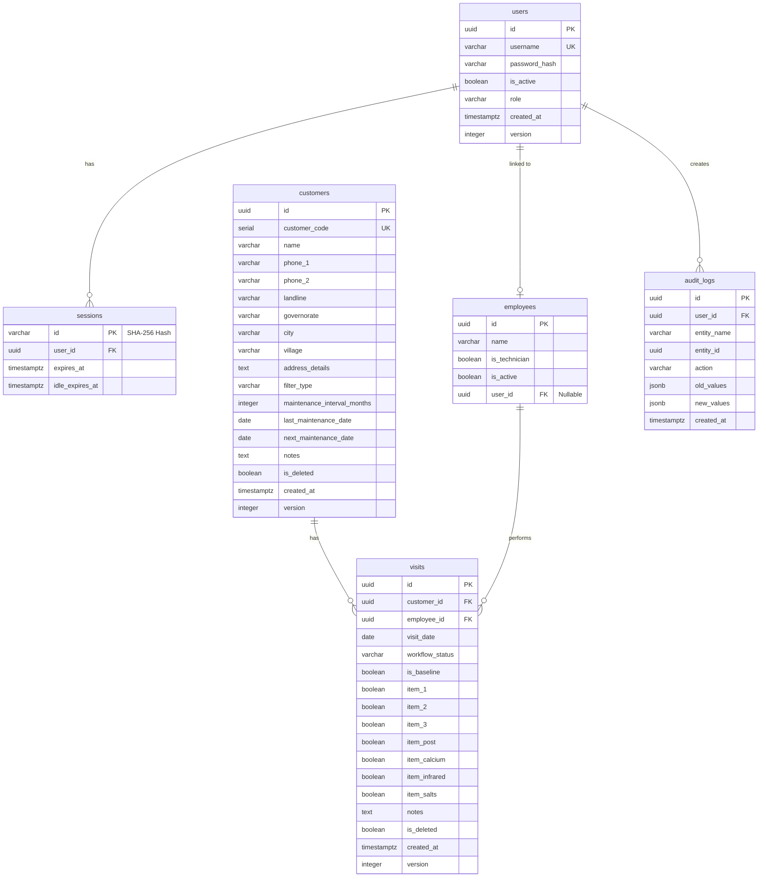

# تصميم قاعدة البيانات (DATABASE.md)

## 1. مخطط الكيانات والعلاقات (ERD)



## 2. تفاصيل الجداول

### `users`
| العمود | النوع | Null | القيود | الوصف |
|---|---|---|---|---|
| id | uuid | No | PK | v7 UUID |
| username | varchar | No | UNIQUE | اسم المستخدم للدخول |
| password_hash | varchar | No | | Argon2id Hash |
| is_active | boolean | No | DEFAULT true | حالة الحساب |
| role | varchar | No | | دور المستخدم (ADMIN, USER...) |
| created_at | timestamptz | No | DEFAULT now() | |
| version | integer | No | DEFAULT 1 | للتعامل مع الـ Concurrency (L-09) |
* **Indexes:** `idx_users_username` (تسريع الدخول)

### `customers`
| العمود | النوع | Null | القيود | الوصف |
|---|---|---|---|---|
| id | uuid | No | PK | v7 UUID |
| customer_code | serial | No | UNIQUE | رقم متسلسل مقروء |
| name | varchar | No | | اسم العميل |
| phone_1 | varchar | No | | رقم الهاتف الأساسي (يقبل 0 في البداية) |
| phone_2 | varchar | Yes | | رقم إضافي |
| landline | varchar | Yes | | رقم أرضي |
| governorate | varchar | No | | المحافظة |
| city | varchar | No | | المدينة |
| village | varchar | Yes | | القرية |
| address_details| text | Yes | | تفاصيل العنوان |
| filter_type | varchar | Yes | | نوع الفلتر |
| maintenance_interval_months | integer | No | CHECK (in 3,4,6) | مدة الصيانة بالأشهر |
| last_maintenance_date | date | Yes | | مُحسب آلياً من الزيارات |
| next_maintenance_date | date | Yes | | مُحسب آلياً من الزيارات |
| notes | text | Yes | | |
| is_deleted | boolean | No | DEFAULT false | Soft Delete (L-10) |
| created_at | timestamptz | No | DEFAULT now() | |
| version | integer | No | DEFAULT 1 | (L-09) |
* **Indexes:** 
  - `idx_customers_phone_1` (للبحث عن التكرار)
  - `idx_customers_name_trgm` (GIN, pg_trgm للبحث النصي)
  - `idx_customers_next_maintenance` (لتسريع جلب التنبيهات والصيانات القادمة)

### `visits` (سجل الصيانة)
| العمود | النوع | Null | القيود | الوصف |
|---|---|---|---|---|
| id | uuid | No | PK | v7 UUID |
| customer_id | uuid | No | FK | |
| employee_id | uuid | No | FK | الفني أو الموظف |
| visit_date | date | No | | تاريخ الزيارة الفعلي |
| workflow_status| varchar | No | | حالة العمل (تمت، ملغاة، الخ) |
| is_baseline | boolean | No | DEFAULT false | زيارة وهمية للتواريخ القديمة (D-02) |
| item_1 | boolean | No | DEFAULT false | شمعة أولى |
| item_2 | boolean | No | DEFAULT false | شمعة ثانية |
| item_3 | boolean | No | DEFAULT false | شمعة ثالثة |
| item_post | boolean | No | DEFAULT false | بوست |
| item_calcium | boolean | No | DEFAULT false | كالسيوم |
| item_infrared | boolean | No | DEFAULT false | إنفراريد |
| item_salts | boolean | No | DEFAULT false | أملاح |
| notes | text | Yes | | |
| is_deleted | boolean | No | DEFAULT false | Soft Delete |
| created_at | timestamptz | No | DEFAULT now() | |
| version | integer | No | DEFAULT 1 | |
* **Indexes:** `idx_visits_customer_id`

### `audit_logs` (سجل العمليات)
| العمود | النوع | Null | القيود | الوصف |
|---|---|---|---|---|
| id | uuid | No | PK | v7 UUID |
| user_id | uuid | No | FK | من قام بالعملية |
| entity_name | varchar | No | | اسم الجدول (users, customers...) |
| entity_id | uuid | No | | مُعرف الكيان المُعدّل |
| action | varchar | No | | CREATE, UPDATE, DELETE |
| old_values | jsonb | Yes | | القيم قبل التعديل |
| new_values | jsonb | Yes | | القيم بعد التعديل |
| created_at | timestamptz | No | DEFAULT now() | |
* **Indexes:** `idx_audit_logs_entity`
* **Trigger:** يمنع أي `UPDATE` أو `DELETE` على هذا الجدول.

## 3. تعريف "حالة العميل" (Due-State)
بحسب D-01 و L-11 (توقيت القاهرة `Africa/Cairo`)، تُحسب الحالة كالتالي:
- **اليوم (Today):** إذا كان `next_maintenance_date` يساوي تاريخ اليوم.
- **متأخرة (Overdue):** إذا كان `next_maintenance_date` أقدم من تاريخ اليوم.
- **قادمة (Upcoming):** إذا كان `next_maintenance_date` في المستقبل.
- **لا يوجد (None):** إذا لم يتم تحديد صيانة قادمة.

## 4. خوارزمية حساب الموعد القادم (P1-04)
يتم حساب `next_maintenance_date` استناداً لآخر زيارة فعلية مسجلة ومدة صيانة العميل `interval`.

**Pseudo-code:**
```javascript
function calculateNextMaintenance(visits, intervalMonths) {
  // 1. استخراج الزيارات غير الملغاة
  const validVisits = visits.filter(v => !v.is_deleted && v.workflow_status === 'تمت');
  
  if (validVisits.length === 0) return null;

  // 2. ترتيب الزيارات تنازلياً حسب التاريخ للحصول على الأحدث
  validVisits.sort((a, b) => b.visit_date - a.visit_date);
  const latestVisitDate = validVisits[0].visit_date; // e.g., '2026-01-31'

  // 3. إضافة الأشهر مع مراعاة نهاية الشهر والسنة الكبيسة
  const nextDate = new Date(latestVisitDate);
  nextDate.setMonth(nextDate.getMonth() + intervalMonths);
  
  // (معالجة Javascript التلقائية تحول 31 فبراير إلى مارس، نحتاج تصحيحها للعمل كـ PostgreSQL)
  // في PostgreSQL: '2026-01-31'::date + interval '1 month' = '2026-02-28'
  
  return nextDate;
}
```

**حالات الاختبار (12 حالة):**
1. **عادية:** زيارة 01/01 + 3 أشهر = 01/04
2. **نهاية شهر:** زيارة 31/01 + 1 شهر (لتجربة الحافة) = 28/02 (أو 29 في الكبيسة)
3. **سنة كبيسة:** زيارة 29/02/2024 + 12 شهر = 28/02/2025
4. **تاريخ قديم (Backdated):** إدخال زيارة بتاريخ 01/01/2025 واليوم هو 01/06/2025 بمدة 3 أشهر = الموعد القادم كان 01/04/2025 (متأخرة).
5. **زيارتان بنفس اليوم:** إدخال زيارتين في 01/05، يأخذ الأحدث (أو إحداهما) + 3 أشهر = 01/08.
6. **حذف آخر زيارة:** عميل لديه زيارة 01/01 وزيارة 01/04. إذا حذفت زيارة 01/04، يعود `last_maintenance` إلى 01/01 و`next` إلى 01/04.
7. **فرق التوقيت (UTC vs Cairo):** زيارة سُجلت الساعة 23:30 UTC يوم 01/05 (تساوي 02:30 يوم 02/05 بالقاهرة) → تُعامل كـ 02/05 + 3 أشهر = 02/08.
8. **نهاية السنة:** زيارة 01/12 + 3 أشهر = 01/03 من العام التالي.
9. **تغيير مدة الصيانة:** عميل تم تغيير مدته من 3 إلى 6 أشهر، آخر زيارة 01/01 → يتحدث الموعد تلقائياً إلى 01/07.
10. **زيارة Baseline:** إدخال عميل بـ Baseline Visit يوم 01/01 بمدة 3 أشهر → الموعد القادم 01/04.
11. **زيارة ملغاة:** زيارة ملغاة يوم 01/05، لا تؤثر على حساب الموعد، ويبقى معتمداً على زيارة 01/01.
12. **إدخال بدون زيارات:** عميل جديد بدون أي زيارة (حتى Baseline) → `next_maintenance_date` هو NULL وحالته "لا يوجد".

